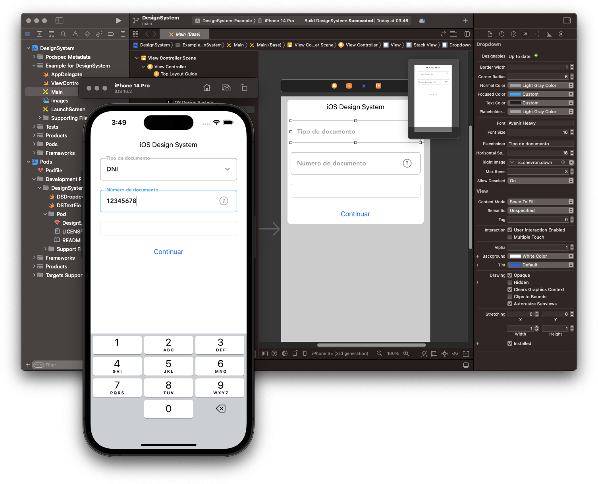

# DesignSystem 📦

DesignSystem is a comprehensive iOS framework written in Swift that enables easy development of beautifully designed user interfaces. It offers a set of ready-to-use components with extensive customization options.

## 🌟 Example

To run the example project, clone the repo, and run `pod install` from the Example directory first.

## 📋 Requirements

- iOS 12.0 and above
- Swift (Foundation & UIKit)

## 🚀 Installation

DesignSystem can be easily integrated into your project using CocoaPods. Simply add the following line to your `Podfile`:

```ruby
pod 'DesignSystem', :git => 'https://github.com/swift-tools/DesignSystem.git'
```

Then, run `pod install` to fetch the framework and include it in your project.

## 🎨 Features

### Customizable Components:

All components provided by DesignSystem are highly customizable. They can be customized either through storyboards or programmatically to suit your application's specific requirements.

- `DSDropdown`: Ready-to-use floating dropdown element that can be easily integrated into your user interface. It provides a visually appealing way to present a selection of options to the user.

- `DSTextField`: Base text field component. It offers a range of visual properties that can be customized, such as `borderColor`, `borderWidth`, `cornerRadius`, and more.



## 📖 Usage

To use DesignSystem components in your project, follow these steps:

1. Import the DesignSystem module in the file where you want to use the components

```swift
import DesignSystem
```

2. Create an instance of the desired component, either programmatically or through the Interface Builder.

3. Customize the component's properties according to your needs. You can modify visual properties such as colors, borders, and corners to achieve the desired look and feel.

4. Add the component to your view hierarchy using methods like `addSubview()` or by connecting outlets in your storyboard.

5. Build and run your project to see the DesignSystem components in action!

## 👨‍💻 Author

[lazymisu](https://github.com/lazymisu)

## 📝 License

Validator is available under the MIT license. See the [LICENSE](https://github.com/swift-tools/DesignSystem/blob/main/LICENSE) file for more info.
